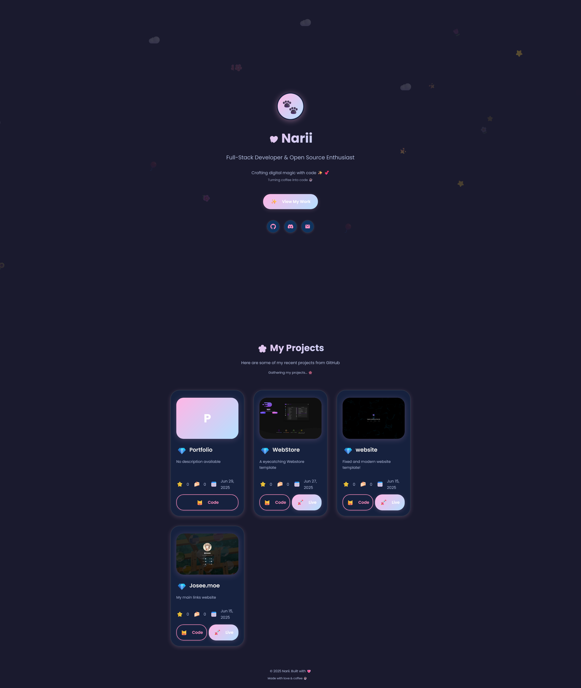

 🖤 Narii's Portfolio

> A modern, dark-themed portfolio that automatically displays your GitHub projects

[](your-demo-link)



[🐛 **Report Bug**](https://github.com/L0veNote/Portfolio/issues)

## Features

- 🌙 Dark & pastel theme
- 🖼️ Project screenshots (static preview)
- 🚀 GitHub integration (auto-fetches your repos)
- 📱 Responsive & mobile-friendly
- ✨ Simple, smooth animations

## How to use

1. Download or clone this repo
2. (Optional) Add your screenshots to the `screenshots/` folder
3. Open `index.html` in your browser

---

Built with HTML, CSS, and JavaScript.

## Technologies Used

- HTML5
- CSS3 (with CSS Grid and Flexbox)
- Vanilla JavaScript (ES6+)
- GitHub API
- Google Fonts (Inter)

## Project Structure

```
portfolio/
├── index.html          # Main HTML file
├── style.css           # All CSS styles
├── script.js           # JavaScript functionality
├── screenshots/        # Project screenshots folder
├── README.md           # This file
└── SCREENSHOTS_GUIDE.md # Guide for adding screenshots
```

## Customization

### Adding Screenshots

To add screenshots for your projects:

1. **Create screenshots** of your projects
2. **Save them** in the `screenshots/` folder
3. **Update the `customProjects` object** in `script.js`:

```javascript
const customProjects = {
    'your-repo-name': {
        name: 'Your Project Name',
        description: 'Your custom description',
        technologies: ['Tech1', 'Tech2', 'Tech3'],
        screenshots: [
            'screenshots/your-project-1.png',
            'screenshots/your-project-2.png',
            'screenshots/your-project-3.png'
        ]
    }
};
```

### Screenshot Guidelines

- **Format**: PNG, JPG, or WebP
- **Size**: Recommended 800x600px or similar aspect ratio
- **Naming**: Use descriptive names like `project-main.png`, `project-mobile.png`
- **Quality**: Keep file sizes reasonable (under 500KB per image)

### Customizing Colors

Edit the CSS variables in `style.css`:

```css
:root {
    --bg-primary: #0a0a0a;
    --bg-secondary: #111111;
    --text-accent: #64ffda;
    /* ... other variables */
}
```

### Excluding Projects

The portfolio automatically excludes:
- Forked repositories
- Archived repositories

## File Organization

The project follows best practices for code organization:

- **`index.html`**: Clean HTML structure with semantic markup
- **`style.css`**: All styles organized with CSS custom properties
- **`script.js`**: Modular JavaScript with clear function separation

## Browser Support

- Chrome
- Firefox (recommended)
- Safari
- Edge
